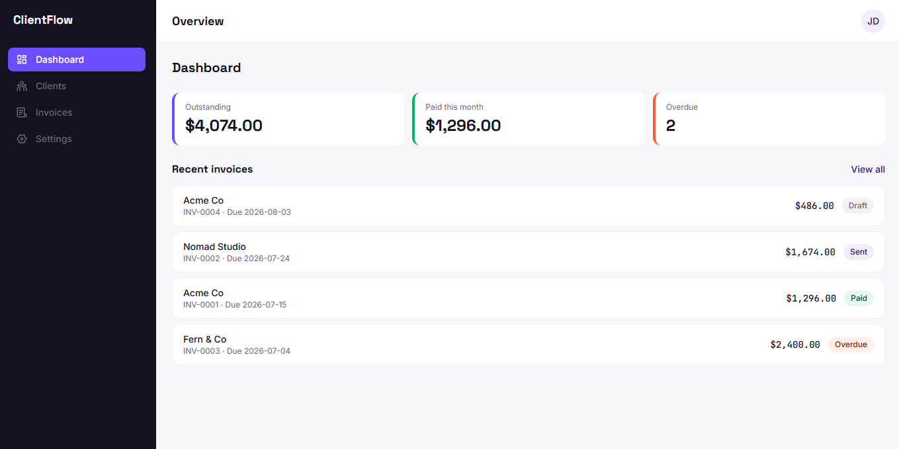
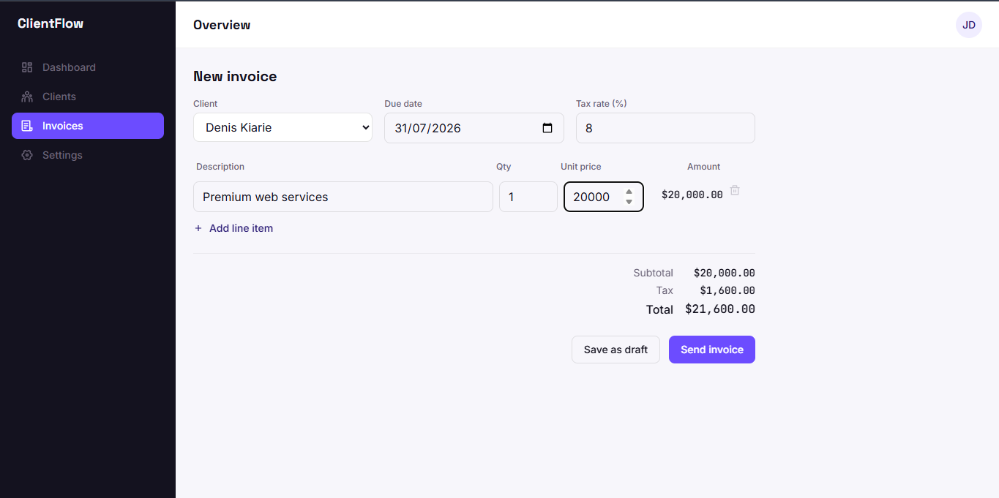
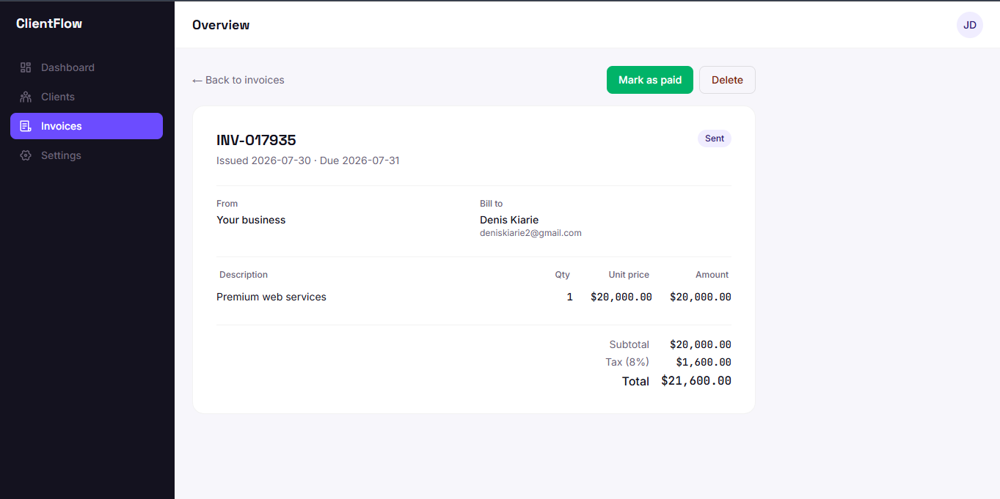

# ClientFlow

A freelancer invoicing and client management app, built as a frontend architecture portfolio project — full CRUD, normalized Redux state, form validation, protected routes, and a service-layer boundary specifically designed to swap in a real Django backend later with minimal changes.

**Live Demo:** [clientflow-invoice App](https://clientflow-invoice.netlify.app/)
**Demo login:** `jordan@example.com` / `password123`


## Screenshots

### Dashboard


### Creating an invoice


### Invoice detail


## Features

- **Clients** — search, add, edit, delete, with a per-client invoice history and a referential-integrity guard (can't delete a client with existing invoices)
- **Invoices** — dynamic line items with live-calculated totals, draft/send workflow, mark-as-paid, status-based color coding
- **Dashboard** — derived stats (outstanding, paid this month, overdue) computed from invoice data, not stored redundantly
- **Settings** — business profile, currency, and invoice number prefix, propagated live throughout the app
- **Auth** — protected routes with redirect-back-to-intended-page on login
- Fully responsive, mobile-first, with a real focus-trapped modal system
- Toast notifications and an error boundary for graceful failure handling

## Tech stack

React (Vite) · Redux Toolkit · Tailwind CSS v4 · Framer Motion · React Router · Zod · React Icons

## Architecture highlights

- **Service layer pattern** — components and Redux slices never call `fetch` directly. Every data operation goes through `src/services/api/`, which currently reads mock JSON with simulated latency. Swapping to a real Django REST API means editing the *inside* of these functions only — nothing calling them changes.
- **Normalized state** — collection slices (`clients`, `invoices`) use `createEntityAdapter` for O(1) lookups by id; `settings` is a plain single-record slice, since it's not a collection.
- **Memoized cross-slice selectors** — `createSelector` joins invoices to client names without recomputing on every render, and without every component doing its own manual `.find()`.
- **Design tokens, not hardcoded values** — colors, fonts, and the status-color system live in Tailwind v4's `@theme` block in `index.css`, so the whole visual language is defined in one place.
- **State placement discipline** — Redux holds data shared across the app; local `useState` holds ephemeral UI state (form drafts, modal open/closed). See `docs/DJANGO_INTEGRATION.md` for how this maps onto a real backend.

## Project structure

```
src/
  app/            # Redux store, typed hooks
  components/     # Shared, domain-agnostic UI (Modal, FormField, Toast, EmptyState...)
  constants/      # Routes, status metadata
  features/       # Domain logic + components, grouped by feature (clients, invoices, auth...)
  hooks/          # Reusable custom hooks (useDebounce)
  pages/          # Route-level components, assembled from features/
  services/       # Mock API layer — the swap point for a real backend
  utils/          # Pure functions (currency formatting, invoice math)
```

## Getting started

```bash
git clone https://github.com/DenisKiarie3/clientflow.git
cd clientflow
npm install
npm run dev
```

## Known limitations

This is a frontend-only project by design — see [docs/DJANGO_INTEGRATION.md](docs/DJANGO_INTEGRATION.md) for what's intentionally deferred to a real backend:

- Data resets on page refresh (mock service state lives in memory, not a database)
- Auth is simulated client-side and not secure — real password verification must happen server-side
- No real payment processing, email sending, or PDF export yet

## Roadmap

Built as part of a structured Django/backend learning path — see `docs/DJANGO_INTEGRATION.md` for the concrete plan to connect this frontend to a real API.